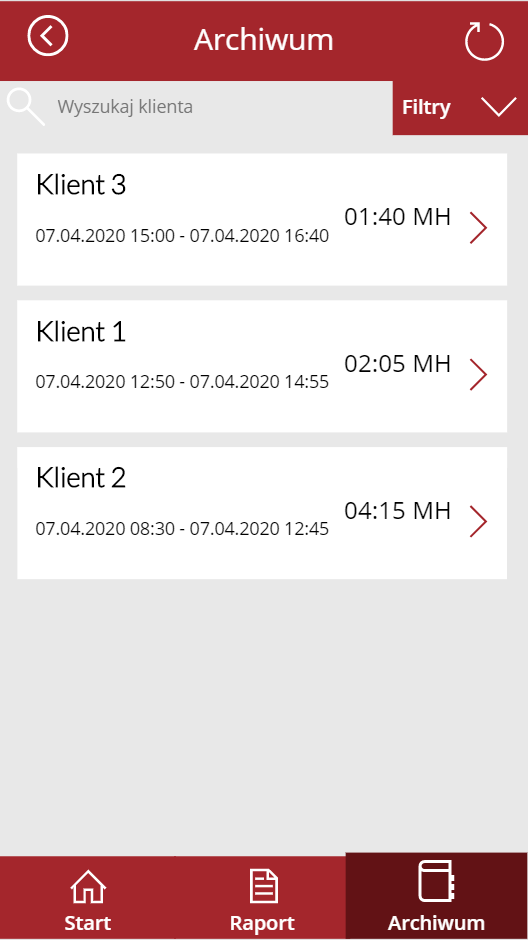
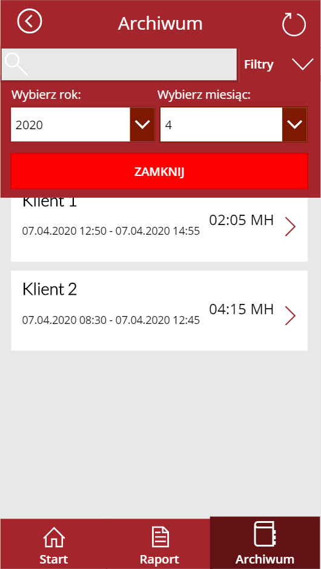
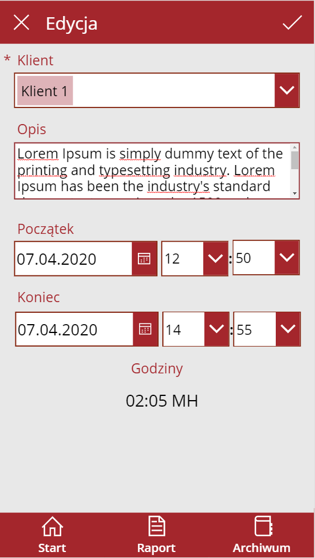

## Ewidencja czasu pracy
Aplikacja do raportowania czasu pracy.

### Opis scenariusza
Aplikacja pozwala na raportowanie czasu pracy przez pracowników terenowych. Z założenia raportowanie czasu pracy ma być maksymalnie uproszczone i pozwalać na śledzenie kosztów pracy po Klientach / Projektach. Ponieważ aplikacja może być wykorzystywana przez użytkowników mobilnych, dodatkowo zapisywana jest ich lokalizacja. Każdy z Projektów / Klientów ma możliwość wskazania Menagera. 

### Funkcje

Użytkownik:
- raportowanie czasu pracy z dokładnością co do minuty 
- przegląd historii swoich raportów 
- wyszukiwanie raportów po klientach, filtrowanie po właściwościach: rok, miesiąc
- możliwość edycji zadań

Manager:
- raportowanie czasu pracy z dokładnością co do minuty 
- przegląd historii swoich raportów 
- wyszukiwanie raportów po klientach, filtrowanie po właściwościach: rok, miesiąc
- widok historii raportów wszystkich użytkowników
- wyszukiwanie raportów po użytkownikach, filtrowanie po właściwościach: klient, rok, miesiąc, status
- możliwość śledzenia zadań użytkowników w czasie żeczywistym
- możliwość włączenia funkcji zapisu lokalizacji przy starcie i zakończeniu zadania
- możliwość edycji zadań

### Architektura rozwiązania
- witryna sharepoint
- 4x listy (zestawienie klientów, role aplikacji, informacje konfiguracyjne aplikacji, raporty zadań)

## Instrukcja Instalacji
Aplikacja jest częścią kursu "Power Apps w Office 365" - po więcej informacji zapraszamy do kontaktu kontakt@AkademiaAplikacji.pl
