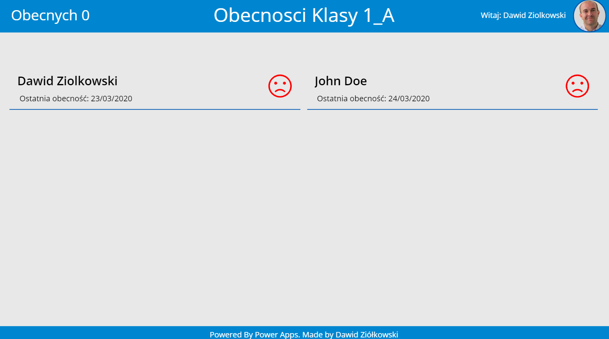
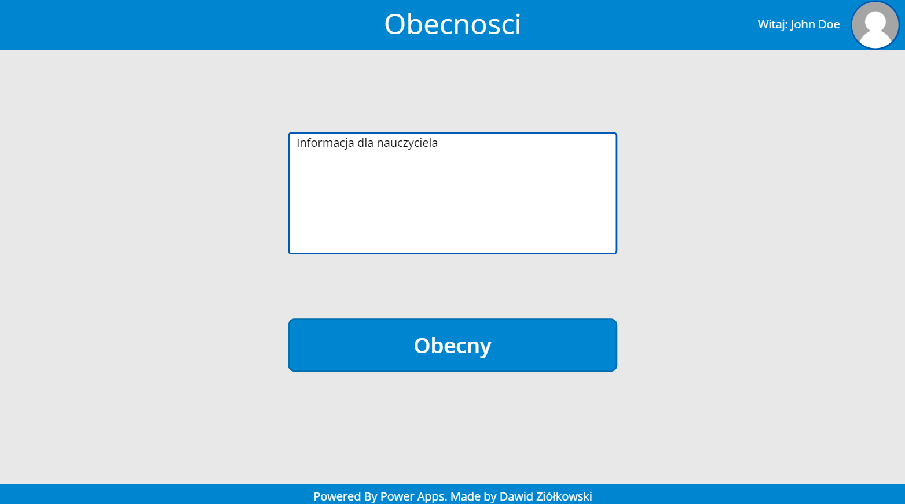
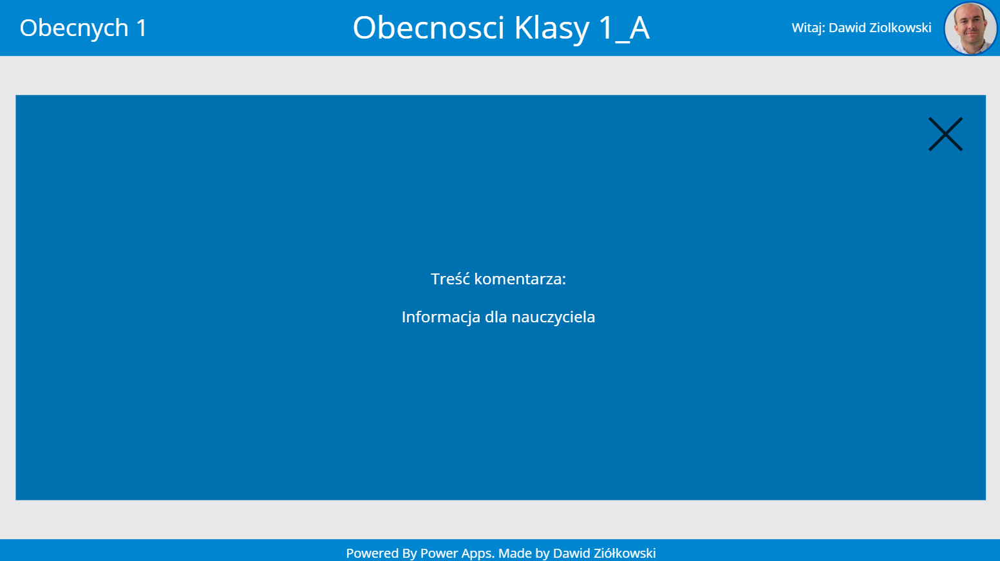

## Sprawdzanie obecnosci
Aplikacja do sprawdzania obecności w szkołach. 

### Opis scenariusza

Szkoły w związku z przeniesieniem lekcji do wersji online wciąż chciałby mieć informację czy Uczniowie są obecni. Aplikacja tak każdego dnia pozwala na wysłanie informacji do Wychowacy oraz potwierdzeniu obecności przez Ucznia.

[Prezentacja applikacji w YouTube](https://youtu.be/xsnJdSmDLgg)

### Funkcje

Perspektywa Ucznia
	• Codzienny email z prośbą o potwierdzenie obecności
	• Możliwość dodanie komentarza dla Wychowawcy
	• Potwierdzenie obecności 
Perspektywa Nauczyciela
	• Codzienny raport z obecnością klasy otrzymany and maila
	• Aplikacja z listą obecnością klasy
	• Możliwość odczytania komentarzy Uczniów w aplikacji
### Architektura rozwiązania
	• 1 SharePoint site 
	• 2 SharePoint listy
	• 1 Power Automate Flow
  
### Instrukcja instlacji
[Instrukcja instalacji](https://youtu.be/F6tS4PzYGmM)
