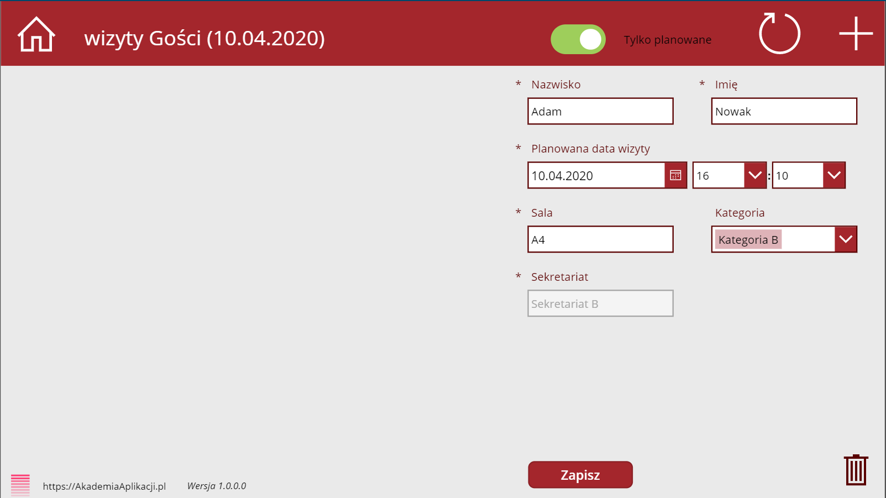
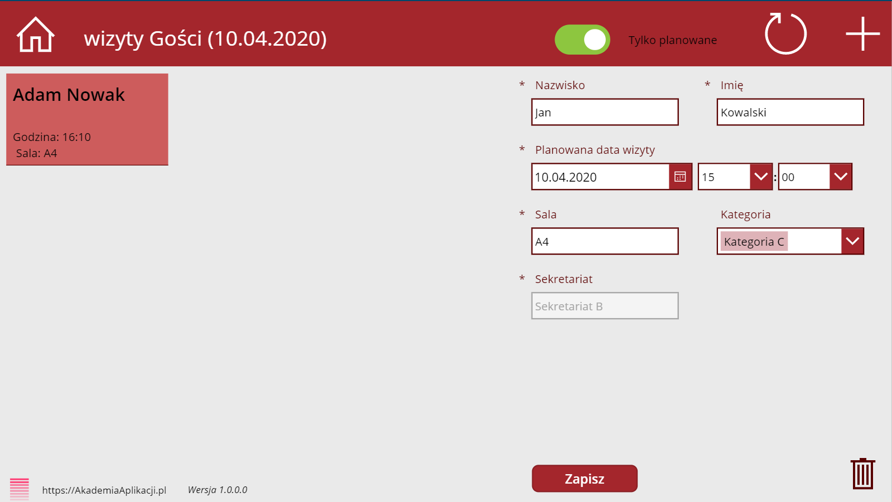
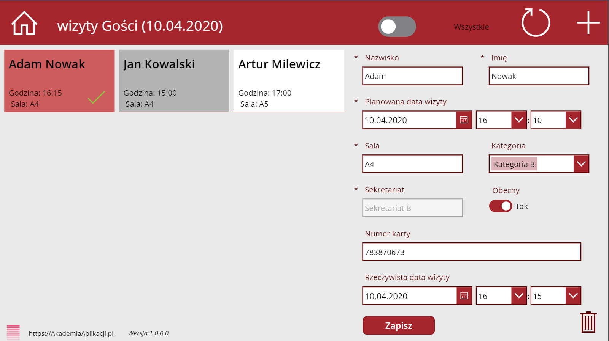
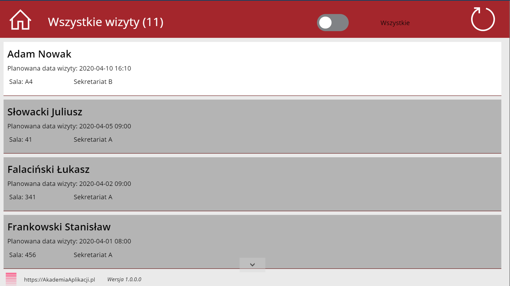
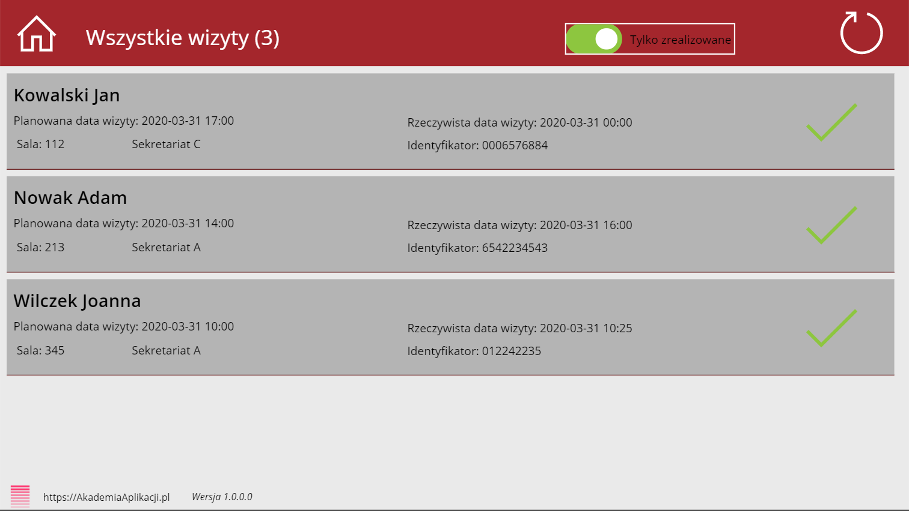
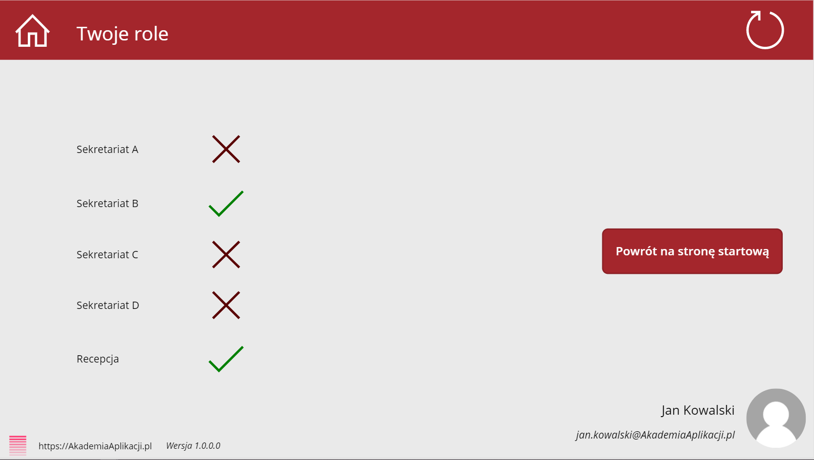

## Rejestr gości
Aplikacja rejestru gości 

### Opis scenariusza
Aplikacja pozwala na planowanie i śledzenie odwiedzających Organizację gości. Pozwala na wskazanie roli sekretariatów, które zapraszają gości oraz recepcji, która odnotowuje wizyty i generuje przepustki.

### Funkcje

- dodawanie, edycja, usuwanie wizyt gości
- sprawdzanie zaplanowanych wizyt na dzień dzisiejszy
- sprawdzanie odbytych wizyt 
- odnotowanie obecności gościa z przypisaniem numeru karty odwiedzającego oraz faktyczną datą i godziną wizyty
- podgląd wszystkich wizyt (zrealizowanych, niezrealizowanych)
- podgląd roli aktualnie zalogowanego użytkownika

### Architektura rozwiązania
- witryna sharepoint
- 2x listy (role aplikacji, wizyty)

## Instrukcja Instalacji
Aplikacja jest częścią kursu "Power Apps w Office 365" - po więcej informacji zapraszamy do kontaktu kontakt@AkademiaAplikacji.pl
