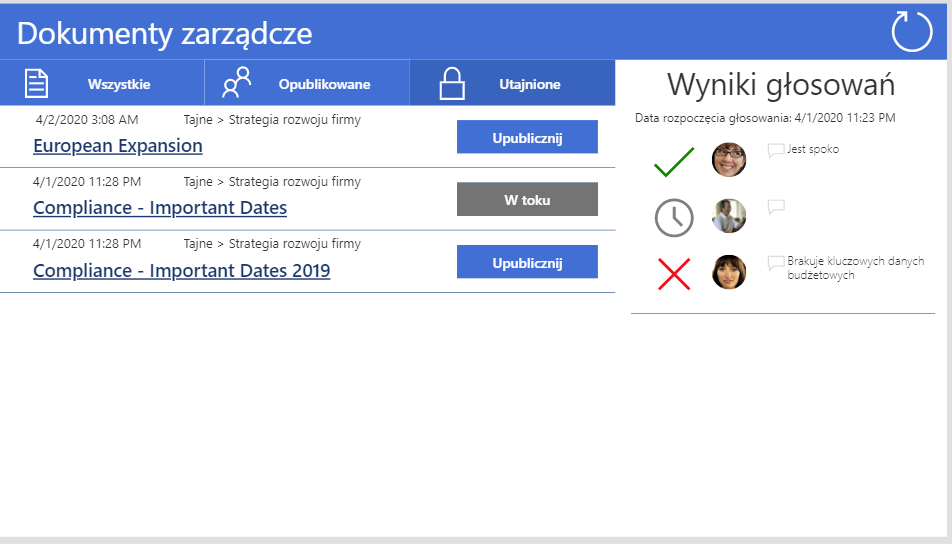

## Upublicznianie tajnych dokumentów
Aplikacja do głosowania za upublicznieniem tajnych dokumentów zarządu.

### Opis scenariusza
W zespole Teams Zarządu dostęp do zespołu często mają ich asystenci oraz starsi kierownicy. 
Natomiast Zarząd często pracuje nad opracowaniem projektów i strategii w tajemnicy przed innymi do czasu upublicznienia informacji. 
I właśnie do upublicznienia tych dokumentów służy aplikacja.

### Funkcje
- możliwość przeglądu wszystkich dokumentów i upublicznienie tych wybranych
- proces upubliczniania wymaga aby każdy członek zarządu wyraził zgodę. 
- każdy z głosujących może wyrazić zgodę na upublicznienie, sprzeciw oraz dodać komentarz do swojej decyzji
- w przypadku sprzeciwu któregokolwiek członka dokument nie zostaje upubliczniony
- możliwość przeglądu historii głosowania
- poddanie dokumentu kolejnegmu głosowaniu nie nadpisuje historii poprzednich wyników

### Architektura rozwiązania
- 1 zespół Teams
- 1 kanał zwykły, 1 kanał prywatny
- 2x biblioteki dokumentów (po jednej na kanał)
- 1 lista z wynikami głosowania
- 1 PowerApps który z interfejsem głosowania
- 1 PowerAutomate który obsługuje proces głosowania
- 1 grupa Office365 która przechowuje informacje o użytkownikach mających dostęp do tajnych informacji
